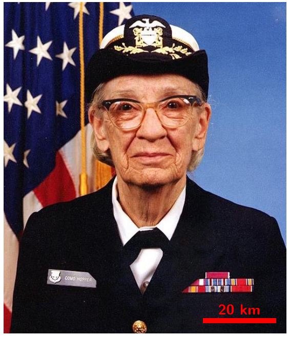
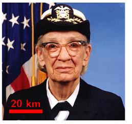
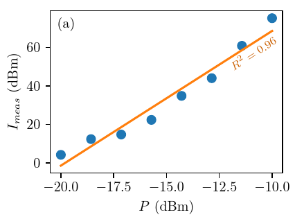

# Latex helpers for thesis writing

Small collection of helpers I wrote for the writing of my PhD thesis
- [Automatic scalebar on pictures](#automatic-scalebar-on-pictures-picture-with-scalebarsty)
- [Figure generation with matplotlib](#figure-generation-with-matplotlib-pythonfiguresty)

## Automatic scalebar on pictures (picture-with-scalebar.sty)

Allows to annotate a picture with a scalebar following a constant style, while fully managing the picture's scaling in LaTeX

### Why ?

At the beginning of my thesis writing, I quickly realized that manually annotating pictures with a scalebar **then** including said annotated picture into my document would create scalebars with different apparent styles, font sizes ... as the pictures would get resized differently.

Instead of wasting an enormous amount of time redoing everything each time I wanted to tweak something, I decided to manage everything on the LaTeX side, with a macro to remove repeated boilerplate

### Examples





### Usage

The macro is `\includegraphicsscale`, and is intended as an extension of `\includegraphics` :


```
\includegraphicsscale[anchor]{key-list}{original-size}{scale-text}{picture-path}
```
- `anchor` (optional) : sets the anchor corner of the scalebar. Can be one of `south east` (default), `south west`, `north east`, `north west`
- `key-list` : list of the parameter which will be passed to `\includegraphics`. 
- `original-size` : real size of the scalebar on the original picture before scaling. For example, if you want a scalebar a quarter of the width of a picture originally 20 cm accros, this parameter would be `5cm`. All lengths understood by LaTeX can be used. In my case, I used the measurment tool in GIMP to measure this distance
- `scale-text` : text to display with the scalebar, indented to show the size it represents (for example `10 µm`)
- `picture-path` : path of the picture, will be passed directly to `\includegraphics`

To have access to this macro, put the `picture-with-scalebar.sty` in the same folder as your .tex file, and add `\usepackage{picture-with-scalebar}` to your preamble.

This macro should be more or less compatible with all parameters of `\includegraphics`. Has been tested with `width`, `height`, `scale`, `angle` (only 90° rotations, others will probably not work as expected), `clip`, `trim`, `page`

If you want to tweak the style of the scalebar, you can adjust the code generating it in the `tikzpicture` at the end of the file.

### How ?

First the scaling is measured by measuring the picture size without the scaling (by using the `key-list` without `width`, `height` and `scale`) and with the scaling (by using the full `key-list`).

Then the scaled picture is included inside a `\tikzpicture`, which draws a rectangle of the length passed to the macro times the scaling and adds the passed text above/below it depending on the anchor corner.

### Caveats

Behind the scenes, the macro uses `tikzpicture` to draw on top of the picture. However, if you want to use the annotated picture inside a `tikzpicture` environment for some reason (like adding custom annotations) errors may appear as a `tizkpicture` inside a `tikzpicture` will inherit all style and global modifications of its parent. To ensure consistent output, I used a savebox to first generate the picture with the scalebar, and used this savebox inside the parent `tikzpicture` :

```latex
\newsavebox{\imagebackup}

[...]

\sbox{\imagebackup}{\includegraphicsscale{width=0.5\textwidth,trim=0cm 1cm 2cm 0.5cm,clip}{1cm}{10 µm}{image.png}}

\begin{tikzpicture}
        \node[inner sep=0] (image) at (0,0) {\usebox{\imagebackup}};
\end{tikzpicture}
```


This macro is intended to be used with isotropic scaling of the picture, so `keepaspectratio` is automatically added to the list of parameters passed to `\includegraphics`

A little bit of white space may be added around the picture for whatever reason. For precise alignement, this can be compensated with some negative `\hspace`/`\vspace` before and/or after the macro.

## Figure generation with matplotlib (pythonfigure.sty)

Allows to fully create a figure/plot/graph/... in matplotlib code while keeping a uniform styling between LaTeX and matplotlib content, and also while fuly controlling the figure size from the LaTeX side. This also implements caching by default

The macro here (`\pythonfigure`) gets the wanted size of the figure, and passes it to a Python script which manages the whole picutre generation using the pgf backend from matplotlib for the "LaTeX-y" styling.

**N.B.** : `pythonfigure-iexec.sty` is not compatible with Windows, and `pythonfigure-lualatex.sty` is only compatible with the LuaLaTeX compiler.

### Why ?

- `pgfplots`, the system to define graphs/plots directly in LaTeX, is not that intuitive and easy to use coming from a Python/matplotlib background, even more when trying to create complex figures, is less flexible than matplotlib and struggles with large datasets
- My figure design workflow is very iterative, where I want to tweak the figure to get everything right, but the solutions for using matplotlib with LaTeX (I had found [tiksplotlib](https://github.com/nschloe/tikzplotlib), the matplotlib pgf backend or this [interesting solution](https://tex.stackexchange.com/a/710138) by tobiasBora on StackExchange) have too much friction for my taste

### Examples



### Usage

The macro relies on executing external command, so the chosen latex compiler must be run with `--shell-escape`.

The macro also trries to forward potential Python errors to the user. Not being well versed in LaTeX macro writing, I used to different mechanicsms to do that, each one not fully compatible with every configuration. `pythonfigure-iexec.sty` uses the `iexec` package, which does not work on Windows, and `pythonfigure-lualatex.sty` uses the LUA scripting capability of the LuaLaTeX compiler. Choose your version, rename it to `pythonfigure.sty` an put it next to your .tex file.

Next to your .tex file, also put the `python-figures` folder with the `do_python_figure.py` file inside, which will host the files with the matplotlib code for the figures.

The macro itself, `\pythonfigure`, has an usage very similar to `\includegraphics` :

```latex
\pythonfigure[key-list]{path}
```
- `key-list`(optional) : parameters of `\includegraphics` defining how the generated picture will be included. `width` and `height` should at least be defined (as the code has no idea what the picture size should be), but default values are defined if these parameters are not fixed (`width = 0.5\textwidth, height=0.2\textheight`)
- `path` : path to the code file generating the figure, starting from inside the `python-figures` folder and without the .py extension. For example, a figure definded in `python-figures/chap1/fig1.py` should be called with `chap1/fig1`

The code itself will be run from the same folder as its location (so relative imports will start from the location of the file itself), with the `matplotlib.pyplot` available as `plt` and `figure` being the Figure object which should be modified to generate the picture. The template file `python-figures/template.py`can be used as a starting point for a polyglot file which can be run standalone (for developement) and with the macro

The integration will run `plt.tight_layout(pad=0.1)` before generating the figure. If you want to use another layout engine (for example constrained layout), set `__activate_tight_layout = False` in your code.

### How ?

The macro extracts the value of `width`and `length` from the `key-list` and passes it with the `path` to an external python script `do_python_figure.py`.

This script first checks if the figure needs to be (re)generated by checking if the target file (`path`+`.py`), wanted width or wanted height changed since the last time using a small file saved alongside the generated figure 

If yes, the script setups the matplotlib figure with the wanted size and the `pgf` backend, changed its working directory to the folder of the script and executes the code inside the target file. At the end, it saves the generated pdf file inside `python-figures/pdf` while following the folder architecture inside it (if `path` is `chap1/fig1`, the pdf will be saved in `python-figures/pdf/chap1/fig1.pdf`)

If the script execution raises an error, this error is raised to the LaTeX compiler used with the full traceback so that the user can act on it.

Finally, whether the script generated a new figure or not, the macro includes the pdf file with `\includegraphics[key-list]{python-figures/pdf/[path].pdf}`

### Caveats

The LaTeX setup for the pdf generation is independant from the one used in the tex file. If you want to have a uniform style between figures and text, you can copy the relevant parts of the preamble (font selection and configuration, ...) into the `"pgf.preamble"` variable following the already existing pattern (`"font.family"` may also be relevant). If you need specific caracters/functionalities provided by external packages, you can also import them here.

A little bit of white space may be added around the picture for whatever reason. For precise alignement, this can be compensated with some negative `\hspace`/`\vspace` before and/or after the macro.

The `pgf` backend is not 100% compatible with all matplotlib functionalities (but in practice close enough, I only ever encountered one not implemented feature : Gouraud shading in `pcolormesh`). Moreover, it can be quite slow to generate figures, especially for large 2D datasets (plotting a 1D dataset of 1MB took around 5 minutes). Thus the work done to avoid regenerating figures as much as possible. 
